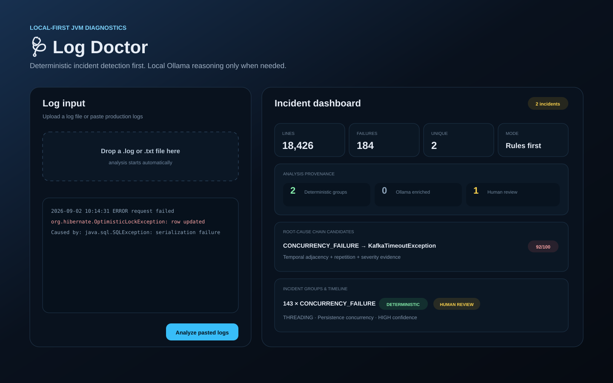

[](https://github.com/mathias82/log-doctor/actions/workflows/ci.yml)


# 🩺 Log Doctor

**Deterministic + local-LLM production log diagnosis for JVM / Spring / Kafka.**

Log Doctor analyzes JVM logs, groups repeated failures, builds timelines, detects spikes, scores likely failure chains, and uses deterministic diagnosis before optional local Ollama reasoning.

> **Log Doctor doesn't replace an LLM. It decides what doesn't need one.**



## Key capabilities

- deterministic incident detection before AI
- broad curated Java/JVM, Spring, Hibernate/JPA, JDBC/Hikari, Kafka and Schema Registry error catalog
- Spring Boot startup failure-analysis extraction with `Description` / `Action` guidance
- deterministic nested exception cause-chain extraction
- explicit `WHY MATCHED` explanations and auditable 0-100 match-strength scoring
- stack-trace-aware grouping with deepest-cause frame association, module/native frame support and dashboard grouping explainability
- structured grouping metadata in grouped API responses so clients do not parse opaque fingerprint delimiters
- structured remediation metadata returned by both single and grouped diagnosis APIs
- remediation safety state, allowed action types and incident-aware verification steps
- typed remediation profiles centralize incident-to-guidance routing so playbooks and verification cannot drift independently
- structured investigation-first remediation playbooks with inspect, change-candidate, validation and escalation phases
- contextual verification guidance for Kafka, Spring Boot startup, HikariCP saturation and JVM OutOfMemory failures
- Markdown reports include remediation safety, allowed actions and verification steps
- dashboard renders backend-owned grouping/remediation metadata and operational playbooks without duplicating policy logic client-side
- explicit `NO_AUTOMATIC_FIX` policy and disabled automatic execution
- multi-incident parsing, fingerprinting, deduplication, timelines, correlations, root-cause candidates and spike detection
- optional local-Ollama enrichment only after deterministic analysis
- structured JSON and downloadable Markdown incident reports
- file upload / drag-and-drop web dashboard
- deterministic sensitive-data redaction before the LLM boundary
- Docker Compose support for Ollama only or the complete Log Doctor + Ollama stack
- real Docker/Ollama end-to-end CI coverage

## Fastest start: full Docker stack

```bash
docker compose up -d --build
```

Web UI: `http://localhost:8080`. Health: `curl http://localhost:8080/api/health`.

## Run Java directly

Requirements: JDK 21, Maven 3.9+, and local Ollama only for LLM-backed analysis.

```bash
mvn clean verify
java -jar target/log-doctor-0.4.2.jar --web
```

Default bind: `127.0.0.1:8080`.

## Web dashboard

The file-first UI accepts `.log`, `.txt`, and `text/plain` inputs up to 5 MB. Files are read by the browser and sent as JSON for analysis; they are not persisted by the server.

Each grouped incident returned by the batch API includes a structured `grouping` object with `strategy`, `exceptionType`, `frames`, and `lineNumbersIgnored`. The dashboard consumes that object directly and no longer reverse-parses the opaque `fingerprint` value. The fingerprint remains available as a stable internal/backward-compatible identity.

Each diagnosis carries the backend-owned `remediation` object when a failure is present. It contains `safety`, `allowedActions`, `verificationSteps`, `automaticExecutionAllowed`, and a structured `playbook`. The dashboard renders the four playbook phases directly from the backend contract as `Inspect evidence`, `Change candidates`, `Validate recovery`, and `Escalate when`. It does not infer remediation policy in JavaScript.

For known deterministic incidents, remediation can be more specific than the broad category. Kafka authorization/replication/consumer/schema/producer cases, Spring Boot startup failures, HikariCP connection-pool exhaustion and JVM OutOfMemory failures receive targeted checks and playbooks while the existing fix policy remains authoritative. These specializations are selected through a typed `RemediationProfile`, so verification guidance and playbook selection share one central routing decision instead of duplicating incident-type string checks.

Unknown, infrastructure, business and other protected cases remain human-review-only. Automatic execution is currently always `false`.

The dashboard shows match evidence, grouping signature, cause chain, remediation guardrails and playbooks, provenance, timeline, investigation order, correlations, root-cause candidates and spikes.

Stack-aware grouping associates the selected deepest visible exception/error/throwable with its own first frames, ignores source line numbers, handles module-qualified frames plus `Native Method` / `Unknown Source`, and ignores suppressed failures when selecting the grouping cause. See [docs/stack-trace-fingerprinting.md](docs/stack-trace-fingerprinting.md).

## API

`POST /api/analyze` returns one structured diagnosis. `POST /api/analyze/batch` returns grouped incidents and advanced batch insights. Both accept JSON with a `log` string.

Example grouping fragment on a grouped incident:

```json
{
  "grouping": {
    "strategy": "STACK_TRACE",
    "exceptionType": "java.lang.nullpointerexception",
    "frames": ["com.acme.orderservice.load(orderservice.java)"],
    "lineNumbersIgnored": true
  }
}
```

Example remediation fragment present on a single diagnosis or grouped incident:

```json
{
  "remediation": {
    "safety": "REVIEW_BEFORE_APPLY",
    "allowedActions": ["SPRING_CONFIG"],
    "verificationSteps": ["Validate the effective runtime configuration"],
    "automaticExecutionAllowed": false,
    "playbook": {
      "inspect": ["FailureAnalysis Description and Action"],
      "changeCandidates": ["Correct the identified configuration/dependency mismatch"],
      "validate": ["Start with the same profile and environment"],
      "escalationSignals": ["Configuration source or secret ownership is unclear"]
    }
  }
}
```

Match confidence is evidence strength only. It never grants execution permission and never overrides `NO_AUTOMATIC_FIX`.

## Rule quality matrix

`DeterministicRuleQualityMatrixTest` protects specialized-rule precedence and representative benign negatives. See [docs/rule-quality-matrix.md](docs/rule-quality-matrix.md).

## Maven Central

```xml
<dependency>
  <groupId>io.github.mathias82</groupId>
  <artifactId>log-doctor</artifactId>
  <version>0.4.2</version>
</dependency>
```

## Release notes

See [CHANGELOG.md](CHANGELOG.md) and [docs/release-notes-0.4.0.md](docs/release-notes-0.4.0.md).
