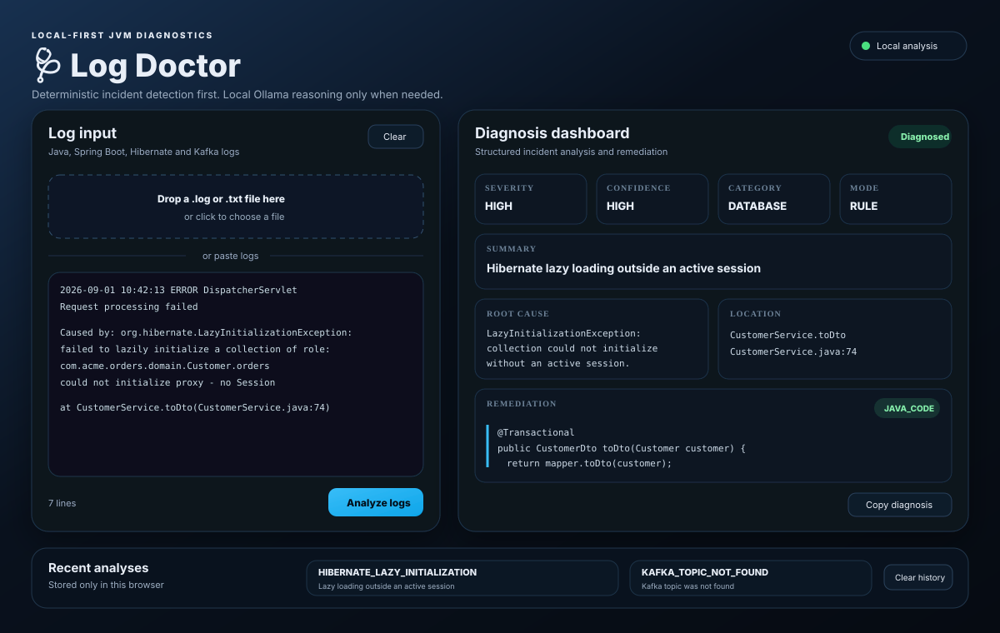

[](https://github.com/mathias82/log-doctor/actions/workflows/ci.yml)


# 🩺 Log Doctor

**Deterministic + local-LLM production log diagnosis for JVM / Spring / Kafka.**

Log Doctor analyzes real JVM log files, groups repeated failures, builds incident timelines, identifies likely failure chains, detects spikes, and uses deterministic diagnosis before optional local Ollama reasoning.

> **Log Doctor doesn't replace an LLM. It decides what doesn't need one.**

<p align="center">
  
  &nbsp;&nbsp;&nbsp;
  
  &nbsp;&nbsp;&nbsp;
  
  &nbsp;&nbsp;&nbsp;
  
  &nbsp;&nbsp;&nbsp;
  
</p>

<p align="center"><sub>Java 21 · Maven · Spring ecosystem · Apache Kafka · local Ollama</sub></p>

## Why Log Doctor?

Production logs are noisy, repeated failures hide the signal, root causes are buried in nested stack traces, and generic AI advice can be unsafe. Log Doctor is designed around four principles:

- deterministic rules before AI
- safe remediation policies before automatic fixes
- local-first analysis with no cloud log upload
- structured evidence instead of opaque recommendations

## Key capabilities

- deterministic detection for common Spring Boot, Hibernate, Kafka, JDBC, memory and threading failures
- multi-incident analysis with failure-block detection, fingerprinting and deduplication
- deterministic-only batch first pass before any optional model call
- at most one local-LLM enrichment call per unique unknown incident fingerprint in batch mode
- grouped incident counts with severity, confidence, category, root cause, location and evidence
- first/last occurrence timeline metadata when timestamps are available
- timestamp-aware likely correlations and scored root-cause chain candidates
- per-minute spike detection against the observed baseline
- generated Markdown incident reports for investigations and postmortems
- upload or drag-and-drop `.log` / `.txt` files directly in the web UI
- automatic analysis immediately after a valid log file is selected
- deterministic redaction before log context reaches the local LLM boundary
- policy-driven fix types and explicit human-review decisions
- local Ollama assistance for unknown or ambiguous failures
- CLI mode plus an embedded web dashboard in the same executable JAR
- browser-local recent-analysis history; raw logs are not persisted by the server
- hardened local HTTP API with payload limits, JSON validation and security headers
- Java 21 CI with unit and HTTP API tests

## Web dashboard

Build the project and start the embedded dashboard:

```bash
mvn clean verify
java -jar target/log-doctor-0.3.0.jar --web
```

Then open:

```text
http://localhost:8080
```

Use a custom port with either form:

```bash
java -jar target/log-doctor-0.3.0.jar --web --port 9090
java -jar target/log-doctor-0.3.0.jar --web --port=9090
```

### Upload a log file and get the diagnosis

The web UI is file-first. A user can click the upload area or drag a `.log` / `.txt` file into it. The browser reads the file locally and starts analysis automatically.

```text
Select / drop log file
        ↓
Read text locally in the browser
        ↓
POST { "log": "..." } to /api/analyze/batch
        ↓
Failure-block detection
        ↓
Deterministic-only diagnosis per block
        ↓
Fingerprinting + grouping + timeline
        ↓
Optional LLM enrichment once per unique unknown group
        ↓
Correlation + root-cause scoring + spikes
        ↓
Structured dashboard + Markdown report
```

Supported upload behavior:

- `.log`, `.txt`, and `text/plain`
- maximum log size: 5 MB
- empty and unsupported files are rejected before analysis
- selected filename, size, and analysis status are shown in the UI
- manual paste + **Analyze pasted logs** remains available
- uploaded files are not persisted on the server
- batch analysis processes up to 500 detected failure blocks and reports when analysis is truncated

### Dashboard preview

<p align="center">
  
</p>

The dashboard includes:

- total lines, analyzed failures and unique incident groups
- investigation order
- likely correlations
- scored root-cause chain candidates
- incident spikes
- per-incident timeline, root cause and remediation
- raw structured batch result
- downloadable Markdown incident report
- the 10 most recent analyses stored only in browser `localStorage`

## CLI usage

Analyze a log file directly:

```bash
java -jar target/log-doctor-0.3.0.jar --file examples/app.log
```

The CLI remains supported while the web dashboard exposes the richer batch-analysis model.

## Local Ollama setup

Install Ollama, pull the configured model, and start the local service:

```bash
ollama pull qwen2.5:3b
ollama serve
```

Ollama normally listens on:

```text
http://localhost:11434
```

Log Doctor does not require a cloud LLM API. If Ollama is unavailable, deterministic diagnosis remains authoritative and unknown incidents fall back safely to human review. In batch mode repeated unknown failures are fingerprinted before model enrichment, so a repeated incident group does not trigger one model request per occurrence.

## Analysis flow

```text
Raw Logs / Uploaded File
          ↓
Failure-block detection
          ↓
Deterministic-only DiagnosisEngine pass
          ↓
Fingerprint + deduplicate
          ↓
Optional LLM enrichment per unique unknown group
          ↓
Timeline + correlations
          ↓
Root-cause scoring + spike detection
          ↓
Structured JSON + Web UI + Markdown report
```

Unknown or ambiguous failures may use local Ollama after sensitive prompt data is redacted. Correlation and chain scoring are heuristic evidence and do **not** prove causation.

## Fix safety

Every deterministic incident is constrained by `FixPolicy`. Some classes of failure intentionally result in `NO_AUTOMATIC_FIX` and require human investigation.

```text
No safe automatic fix, human investigation required.
```

Refusing to guess is part of the product behavior.

## HTTP API

Health check:

```bash
curl http://localhost:8080/api/health
```

Analyze a single log payload:

```bash
curl -X POST http://localhost:8080/api/analyze \
  -H 'Content-Type: application/json' \
  -d '{"log":"java.lang.IllegalStateException: transition not allowed"}'
```

Analyze a real log stream with grouping, timeline, correlations, spikes and report generation:

```bash
curl -X POST http://localhost:8080/api/analyze/batch \
  -H 'Content-Type: application/json' \
  -d '{"log":"2026-09-01 14:32:17 ERROR request failed\njava.lang.RuntimeException: boom"}'
```

The API accepts JSON only, enforces the 5 MB decoded-log limit, and binds to `127.0.0.1` by default.

## Sensitive-data redaction

Before log context reaches the local LLM boundary, Log Doctor performs deterministic best-effort redaction for common sensitive values including:

- bearer tokens and JWTs
- passwords and secrets
- API keys, access tokens and refresh tokens
- secret query-string parameters
- email addresses
- IPv4 addresses

Redaction is a defense-in-depth measure, not a guarantee that every possible secret format will be detected.

## Maven Central

The project is configured for Maven Central publishing with these coordinates:

```xml
<dependency>
    <groupId>io.github.mathias82</groupId>
    <artifactId>log-doctor</artifactId>
    <version>0.3.0</version>
</dependency>
```

The dependency becomes resolvable from Maven Central only after the corresponding version has been successfully published. Release publishing is intentionally separate from normal CI.

Publishing uses the Sonatype Central Publisher Portal and the `central-publishing-maven-plugin`. The `central` Maven profile also attaches source and Javadoc JARs and signs release artifacts with GPG. A pushed release tag such as `v0.3.0` triggers `.github/workflows/publish-maven-central.yml`, verifies that the tag matches the POM version, runs the test suite, and then publishes the signed bundle.

Before the first publish, the repository owner must complete the one-time publisher setup:

1. create/sign in to the Sonatype Central Publisher Portal and verify the `io.github.mathias82` namespace;
2. generate a Central Portal user token;
3. configure a GPG signing key whose public key is available to signature-verification infrastructure;
4. add these GitHub Actions repository secrets: `CENTRAL_USERNAME`, `CENTRAL_PASSWORD`, `GPG_PRIVATE_KEY`, and `GPG_PASSPHRASE`;
5. merge the publishing configuration, verify `main`, then create the version tag only when the release is ready to be immutable.

Do not reuse a published Maven Central version: Central releases are immutable. Increment the project version for every subsequent release.

## Build and test

Requirements:

- JDK 21
- Maven 3.9+
- Ollama only when exercising LLM-backed analysis

Run the full verification suite:

```bash
mvn clean verify
```

GitHub Actions runs the same verification flow for pushes and pull requests targeting `main`.

## Supported incidents

Representative deterministic rules include:

- Hibernate `LazyInitializationException`
- Spring `NoSuchBeanDefinitionException`
- Spring profile/configuration mismatches
- Jackson / JSON deserialization failures
- Kafka topic and schema failures
- HikariCP timeouts
- deadlocks and thread starvation
- `OutOfMemoryError`
- GC thrashing

See [Supported Errors](docs/supported-errors.md) and [Detailed Incident Breakdown](docs/incidents.md) for the current rule catalog.

## Project structure

```text
src/main/java/io/github/mathias82/logdoctor/
├── cli/
├── core/
├── engine/
├── llm/
├── rules/
└── web/

src/main/resources/web/
├── index.html
├── app.css
└── app.js
```

## Release notes

See [CHANGELOG.md](CHANGELOG.md) for version history and [0.3.0 release notes](docs/release-notes-0.3.0.md) for the current release summary.

## Philosophy

- Determinism before AI
- Safety before automation
- Local-first, privacy-first
- Evidence before causation claims
- Production realism over demos

## License

Apache 2.0 License — use it, extend it, improve it.
