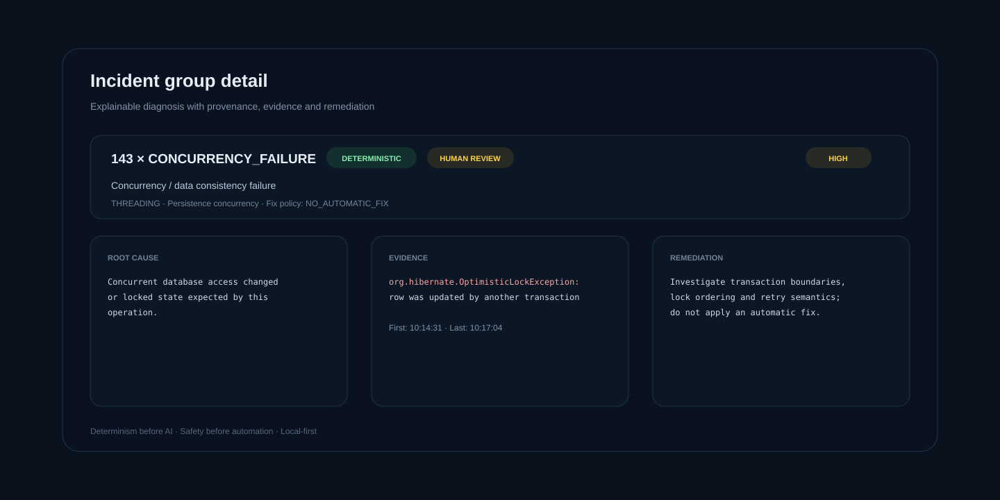

[](https://github.com/mathias82/log-doctor/actions/workflows/ci.yml)


# 🩺 Log Doctor

**Deterministic + local-LLM production log diagnosis for JVM / Spring / Kafka.**

Log Doctor analyzes JVM logs, groups repeated failures, builds timelines, detects spikes, scores likely failure chains, and uses deterministic diagnosis before optional local Ollama reasoning.

> **Log Doctor doesn't replace an LLM. It decides what doesn't need one.**


## Key capabilities

- deterministic incident detection before AI
- broad curated Java/JVM, Spring, Hibernate/JPA, JDBC/Hikari, Kafka and Schema Registry error catalog
- Spring Boot startup failure-analysis extraction with `Description` / `Action` guidance
- deterministic nested exception cause-chain extraction
- explicit `WHY MATCHED` explanations for deterministic diagnoses
- auditable 0-100 deterministic match-strength scoring
- grouped incidents retain cause chain, match reasons, match score and score factors in the batch API and dashboard
- deterministic rule-quality matrix protecting precedence and representative false-positive behavior in CI
- stack-trace-aware incident grouping that ignores volatile source line numbers while preserving stable call-path identity
- grouping explainability in the dashboard with the exception type and stable call-path frames used for deduplication
- structured remediation safety metadata with allowed action types and verification steps
- dashboard remediation guardrails showing human-review requirements and explicitly disabled automatic execution
- multi-incident failure-block parsing, fingerprinting and deduplication
- one optional local-LLM enrichment per unique unknown fingerprint in batch mode
- timeline, correlations, root-cause candidates and spike detection
- structured JSON and downloadable Markdown incident reports
- file upload / drag-and-drop web dashboard
- visible deterministic/Ollama provenance and human-review state in the web UI
- deterministic sensitive-data redaction before the LLM boundary
- explicit `NO_AUTOMATIC_FIX` safety policy for unsafe cases
- browser-local recent-analysis history without persisting raw logs server-side
- Docker Compose support for Ollama only or the complete Log Doctor + Ollama stack
- real Docker/Ollama end-to-end CI coverage

## Fastest start: full Docker stack

The repository includes a multi-stage `Dockerfile` and `compose.yml` that run **Log Doctor and Ollama together**. No local Java, Maven or Ollama installation is required once Docker is available.

```bash
docker compose up -d --build
```

Startup flow:

```text
Ollama container
      ↓ healthy
Model bootstrap container pulls qwen2.5:3b
      ↓ completed
Log Doctor container starts
      ↓
Web UI on http://localhost:8080
```

Verify and open:

```bash
curl http://localhost:8080/api/health
```

```text
http://localhost:8080
```

Test batch diagnosis:

```bash
curl -X POST http://localhost:8080/api/analyze/batch \
  -H 'Content-Type: application/json' \
  -d '{"log":"2026-09-01 14:32:17 ERROR request failed\njava.lang.RuntimeException: unusual distributed state transition"}'
```

Stop while keeping the model:

```bash
docker compose down
```

Remove persisted model data too:

```bash
docker compose down -v
```

Overrides:

```bash
OLLAMA_MODEL=qwen2.5:0.5b docker compose up -d --build
LOG_DOCTOR_PORT=9090 docker compose up -d --build
```

Inside Docker, Log Doctor connects to `http://ollama:11434` and binds to `0.0.0.0` so the published port is reachable.

## Ollama-only Docker setup

```bash
docker compose -f compose.ollama.yml up -d
curl http://localhost:11434/api/tags
```

```bash
docker compose -f compose.ollama.yml down
```

Use `down -v` to remove persisted model data.

## Run Java directly

Requirements: JDK 21, Maven 3.9+, and local Ollama only for LLM-backed analysis.

```bash
mvn clean verify
java -jar target/log-doctor-0.4.2.jar --web
```

Default bind: `127.0.0.1:8080`.

```bash
java -jar target/log-doctor-0.4.2.jar --web --port 9090
java -jar target/log-doctor-0.4.2.jar --web --host 0.0.0.0
LOG_DOCTOR_BIND_ADDRESS=0.0.0.0 java -jar target/log-doctor-0.4.2.jar --web
```

Ollama configuration:

```text
LOG_DOCTOR_OLLAMA_URL
LOG_DOCTOR_OLLAMA_MODEL
```

Defaults outside the full Docker stack remain `http://localhost:11434` and `qwen2.5:3b`.

## Web dashboard

The file-first UI accepts `.log`, `.txt`, and `text/plain` inputs up to 5 MB. Files are read by the browser and sent as JSON for analysis; they are not persisted by the server.

Batch analysis processes up to 500 detected failure blocks and reports `truncated=true` when the cap is exceeded. Clean logs return zero detected failure blocks instead of a synthetic incident.

Each grouped incident carries deterministic match and safety context. The dashboard exposes **Why matched**, **Grouping signature**, **Cause chain**, **Match score factors**, root cause, evidence and remediation. It also derives the remediation guardrails from the same category/fix-policy contract used by the backend: a safety state, allowed action types and category-specific verification steps. Automatic remediation execution remains explicitly disabled; these fields are guidance for reviewed operator action, not an auto-fix engine.

When stack traces are present, batch grouping incorporates a stable call-path signature: deepest visible exception/error type plus up to three frames, with source line numbers removed. This keeps the same failure grouped across builds while preventing unrelated call sites with the same diagnosis text from collapsing into one incident. See [docs/stack-trace-fingerprinting.md](docs/stack-trace-fingerprinting.md).

The dashboard also shows incident grouping, severity/confidence/category, deterministic-vs-Ollama provenance, human-review state, fix policy, timeline, investigation order, likely correlations, scored root-cause chain candidates, spikes, raw structured JSON and a downloadable Markdown incident report.



## Rule quality matrix

`DeterministicRuleQualityMatrixTest` provides an end-to-end regression baseline across representative JVM, Spring, Hibernate/JPA and Kafka failures. It asserts the exact deterministic rule that should win and includes benign log examples that must remain unmatched, protecting specialized-rule precedence as the broad catalog grows.

See [docs/rule-quality-matrix.md](docs/rule-quality-matrix.md) for the contribution checklist and current coverage.

## API

`POST /api/analyze` returns one structured diagnosis. `POST /api/analyze/batch` returns grouped incidents and advanced batch insights. Both accept JSON with a `log` string.

## Maven Central

```xml
<dependency>
  <groupId>io.github.mathias82</groupId>
  <artifactId>log-doctor</artifactId>
  <version>0.4.2</version>
</dependency>
```

## Release notes

See [CHANGELOG.md](CHANGELOG.md) and [docs/release-notes-0.4.0.md](docs/release-notes-0.4.0.md).
